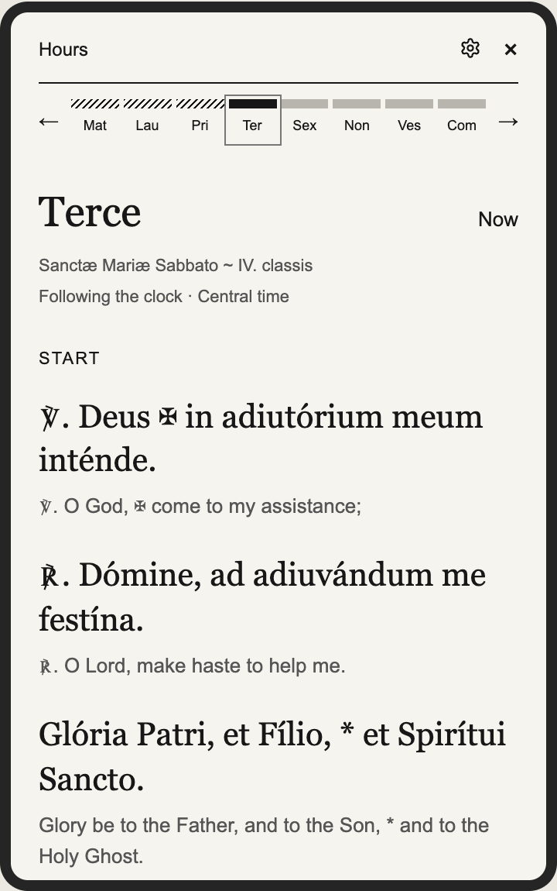

# Muse Pocket · Mac preview and Hours

A development fork of [viticci/muse-pocket](https://github.com/viticci/muse-pocket),
with a Mac preview for a personal e-paper companion. The original firmware targets
the **Xteink X4 Pro**. This fork’s new application features currently run on the Mac;
they have not been integrated into or verified on the reader.

## Preview features

- **Muse avatar:** a large character image and short caption, updated by explicit Muse commands.
- **Watches:** a curated list with per-item check times and stale-data indicators.
- **What’s Next:** the next event, weekday, local countdown, and expiry.
- **Hours:** open the compact timeline to read Latin and English, with distinct typography,
  an active-hour indicator, and header controls that scroll away with the content.

The Hours view reads offline dated prayer data independently of Muse. Its bundled
pack covers **October 2–November 2, 2026**, using Divinum Officium’s general
**Monastic – 1963** calendar. Clear Creek local propers are not verified. The modern
Liturgy of the Hours setting exists, but its prayer texts are not bundled. Missing
dates and traditions are shown as unavailable; extraction and alignment still need
liturgical review.

## Screenshots

Offline Mac previews with synthetic content and the built-in placeholder character.
Watches and What’s Next appear farther down the scrollable Muse view.

<p>
  
  
</p>

## Try it on a Mac

Clone this fork and [muse-gadget-macos](https://github.com/rjohnt/muse-gadget-macos)
next to each other. From this checkout:

```sh
uv venv .venv-preview --python 3.12
uv pip install --python .venv-preview/bin/python -e '../muse-gadget-macos[test]'
.venv-preview/bin/python tools/mac_preview/run.py preview
```

The offline preview needs no token, Bluetooth, or reader. For pairing and real Muse
updates, follow the [Mac preview guide](tools/mac_preview/README.md). The separate
Mac adapter owns CoreBluetooth pairing and the encrypted SDK session; this fork
owns the Pocket UI and commands.

```sh
.venv-preview/bin/python -m pytest tools/mac_preview
```

See [prayer-pack provenance and regeneration](tools/office/README.md). This is a
development snapshot, not a complete perpetual liturgical calendar or a ready-to-flash
Hours release.

## Existing X4 Pro firmware

The inherited firmware displays a Muse character and caption, with brightness,
warmth, orientation, refresh and sleep settings. Its upstream hardware validation
does not validate this fork’s new preview features.

You need an **X4 Pro**, **CrossPoint 1.6.5 for X4 Pro** in the recovery slot, a microSD
card, Wi-Fi, Muse Developer mode, your own SDK token, and **ESP-IDF 6.0.1**.
The X3 and ordinary X4 are not supported by this firmware.

1. [Build and privately add your token](docs/build.md).
2. [Install, pair and recover](docs/install.md) using CrossPoint’s **app-only SD updater**.
3. [Use the existing firmware commands](docs/usage.md).

Keep the bootloader, partition table and CrossPoint recovery slot intact. Remote
firmware updates remain disabled. A packaged firmware image contains your token:
keep it local and never upload it to GitHub or an issue.

## Development and privacy

Read [CONTRIBUTING.md](CONTRIBUTING.md) and [AGENTS.md](AGENTS.md). The included
[muse-pocket skill](skills/muse-pocket/SKILL.md) covers pinned builds and safe SD updates.
Only source, synthetic examples and public prayer data belong in commits. SDK tokens,
pairing state, personal display payloads and private firmware stay local.

## License and upstream

Source retains [Apache-2.0](LICENSE) and the notices in [NOTICE](NOTICE).
Divinum Officium-derived text retains its [MIT notice](tools/office/DIVINUM-LICENSE).
No license-excluded SDK avatar or generated personal Muse character is bundled here.
This community fork is not an official Xteink or Meta product. Pairing also requires
the [Gadget SDK Terms](https://gadgets.muse.ai/sdk-terms).
