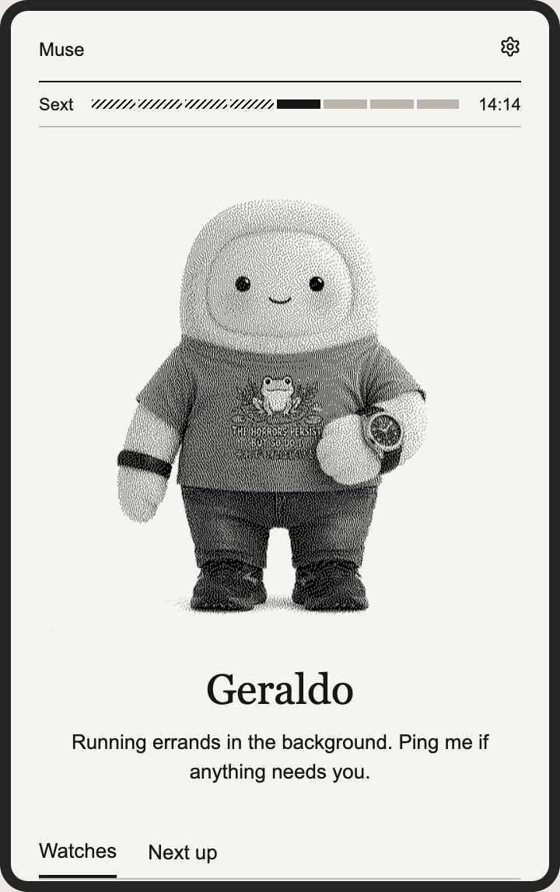

# Muse Pocket · Mac preview and Hours

A development fork of [viticci/muse-pocket](https://github.com/viticci/muse-pocket),
with a Mac preview for a personal e-paper companion. The original firmware targets
the **Xteink X4 Pro**. This fork’s features run in the Mac preview and are built
into the firmware; the firmware screens are checked by host rendering tests and
have not yet been verified on the reader.

## Preview features

- **Muse avatar:** a large character image and short caption, updated by explicit Muse commands.
- **Watches:** a curated list with per-item check times and stale-data indicators.
- **What’s Next:** the next event, weekday, local countdown, and expiry.
- **Hours:** the Liturgy of the Hours is a daily cycle of Christian prayer at set times.
  Follow the active prayer hour and read Latin alongside English in a focused,
  scrollable view that works offline, independently of Muse. The preview includes
  Benedictine prayers for October 2–November 2, 2026, from Divinum Officium’s general
  Monastic – 1963 calendar; Clear Creek’s local variations and text alignment still
  need review. Modern Hours texts are not yet included, and unavailable dates or
  traditions are clearly marked.

## Screenshots

The Muse screenshot shows the running Mac preview with Geraldo’s delivered avatar
and current caption. The Hours screenshot uses the offline prayer pack. Watches
and What’s Next appear farther down the scrollable Muse view.

<p>
  
  
</p>

## Try it on a Mac

Clone this fork and [muse-gadget-macos](https://github.com/rjohnt/muse-gadget-macos)
next to each other. From this checkout:

```sh
uv venv .venv-preview --python 3.12
uv pip install --python .venv-preview/bin/python -e '../muse-gadget-macos[test]'
.venv-preview/bin/python tools/mac_preview/run.py preview
```

The offline preview needs no token, Bluetooth, or reader. For pairing and real Muse
updates, follow the [Mac preview guide](tools/mac_preview/README.md). The separate
Mac adapter owns CoreBluetooth pairing and the encrypted SDK session; this fork
owns the Pocket UI and commands.

```sh
.venv-preview/bin/python -m pytest tools/mac_preview
```

See [prayer-pack provenance and regeneration](tools/office/README.md). This is a
development snapshot, not a complete perpetual liturgical calendar or a ready-to-flash
Hours release.

## X4 Pro firmware

The firmware carries the same screens as the preview, drawn for the reader’s
480×800 e-paper panel and its buttons:

- **Muse:** the active prayer hour and clock, the character enlarged to fill the
  space, its name and caption, and the Watchlist and Next up tabs.
- **Watchlist** and **Next up:** the cards the paired Muse sends, with stale
  marking and a countdown computed on the device.
- **Hours:** the dated offices, built into the image, read a page at a time with
  each Latin line above its own translation.
- **Prayers:** common prayers, opened from the beads at the end of the hour strip.
- **Settings:** frontlight, refresh, orientation, Hours text size, tradition,
  clock format, timezone, sleep and the return to CrossPoint.

Right moves forward, Left moves back, Power returns to Muse, and holding Right
opens Settings; touch targets match what is on screen. The clock is set from the
network once Muse is connected. See [display, settings and commands](docs/usage.md).

These screens are rendered and checked on the host by
`esp32/tools/pocket/test_ui.py`. They have been installed on one X4 Pro during
development but have not been systematically verified on hardware, and the
inherited upstream hardware validation does not cover them. The prayer texts in
`tools/office/prayers.json` were entered by hand and still need proofreading.

Two earlier drafts are kept for reference and are not part of the build:
`esp32/main/office/engine.cpp` and `engine.h`, a first layout engine for an
ordinary-only office, and `tools/office/build_content.py` with its output
`benedictine.json`, which prepared that ordinary without a calendar.

You need an **X4 Pro**, **CrossPoint 1.6.5 for X4 Pro** in the recovery slot, a microSD
card, Wi-Fi, Muse Developer mode, your own SDK token, and **ESP-IDF 6.0.1**.
The X3 and ordinary X4 are not supported by this firmware.

1. [Build and privately add your token](docs/build.md).
2. [Install, pair and recover](docs/install.md) using CrossPoint’s **app-only SD updater**.
3. [Use the screens, settings and commands](docs/usage.md).

Keep the bootloader, partition table and CrossPoint recovery slot intact. Remote
firmware updates remain disabled. A packaged firmware image contains your token:
keep it local and never upload it to GitHub or an issue.

## Development and privacy

Read [CONTRIBUTING.md](CONTRIBUTING.md) and [AGENTS.md](AGENTS.md). The included
[muse-pocket skill](skills/muse-pocket/SKILL.md) covers pinned builds and safe SD updates.
Source, public prayer data, and explicitly shared screenshots belong in commits.
SDK tokens, pairing state, private watch/event data and private firmware stay local.

## License and upstream

Source retains [Apache-2.0](LICENSE) and the notices in [NOTICE](NOTICE).
Divinum Officium-derived text retains its [MIT notice](tools/office/DIVINUM-LICENSE).
The SDK’s license-excluded Jollybot asset is not bundled. The README screenshot
includes the author’s own Muse avatar, shared as an illustration outside the source-code license.
This community fork is not an official Xteink or Meta product. Pairing also requires
the [Gadget SDK Terms](https://gadgets.muse.ai/sdk-terms).
